# MyDBDiagram.io - Backend Design Document

## 1. Overview

This document describes the backend architecture and design of MyDBDiagram.io at a logical level, focusing on class relationships, request flows, and module structure through diagrams.

## 2. Backend Architecture Overview

The backend follows a layered architecture:
- **Routes Layer**: API endpoint definitions
- **Controllers Layer**: Request handling
- **Services Layer**: Business logic
- **Repositories Layer**: Data access
- **Middleware**: Cross-cutting concerns

## 3. Class Diagram - Core Backend Classes

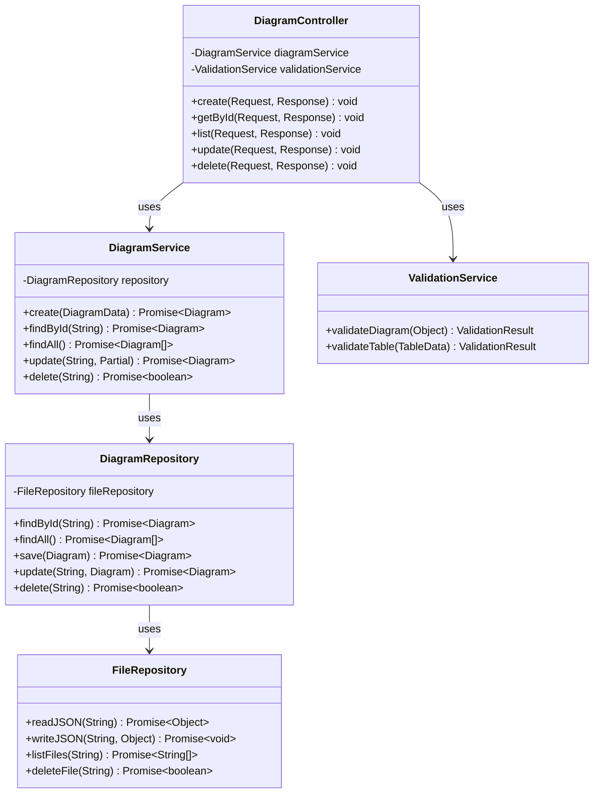

## 4. Class Diagram - Export System

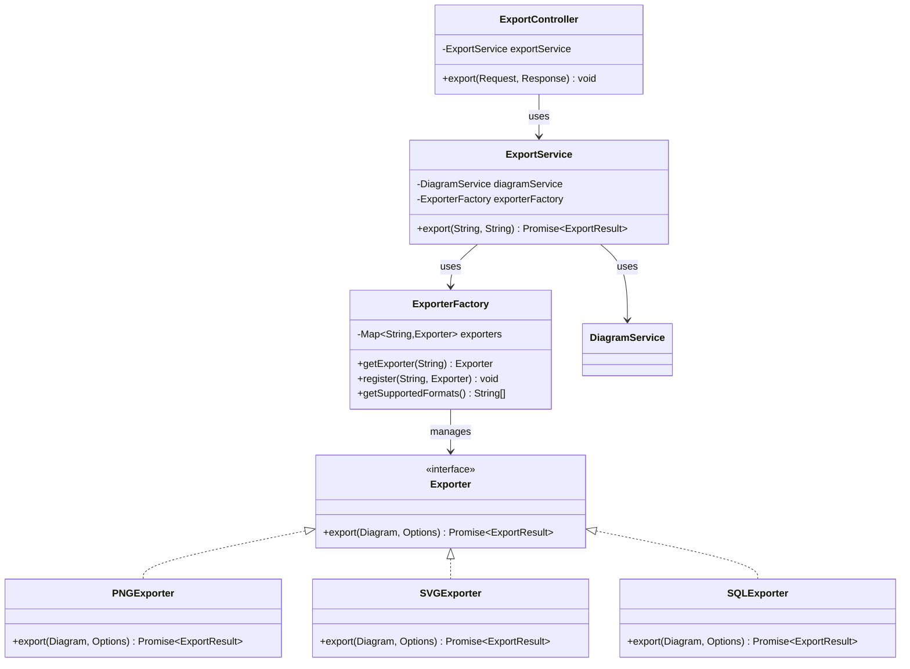

## 5. Sequence Diagram - Creating a Diagram

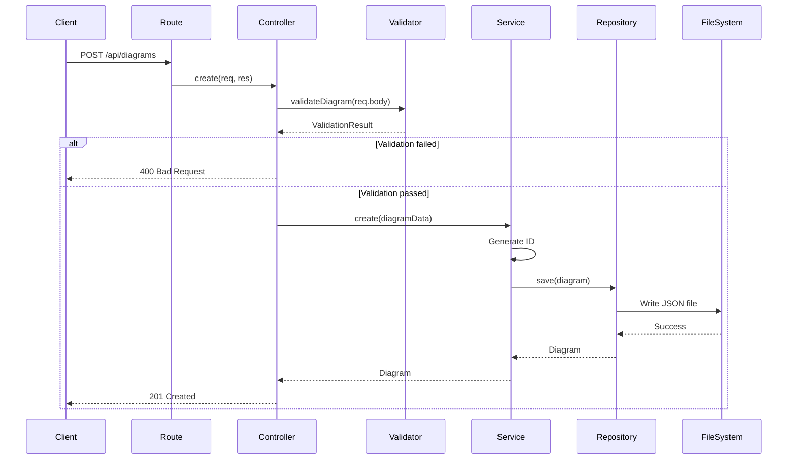

## 6. Sequence Diagram - Exporting Diagram

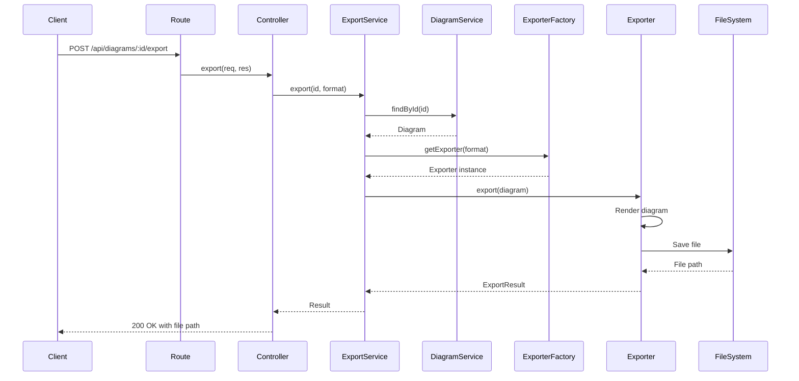

## 7. Sequence Diagram - Loading Diagram

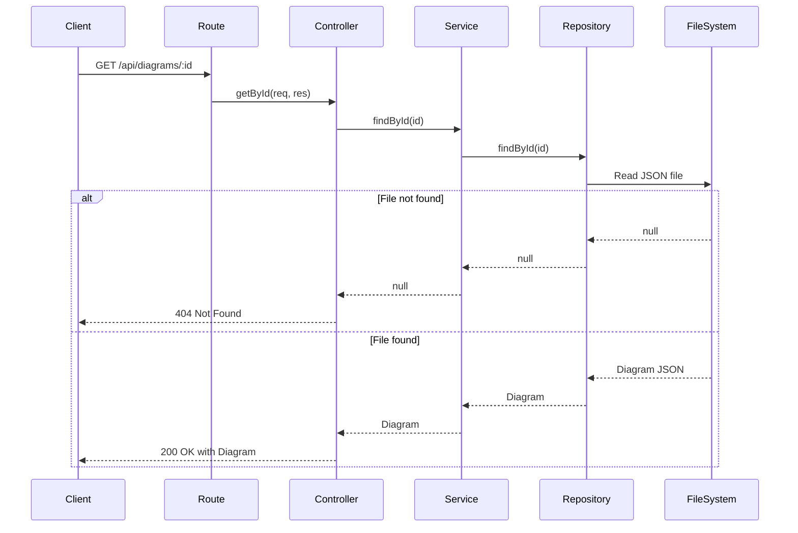

## 8. Block Diagram - Backend Module Structure

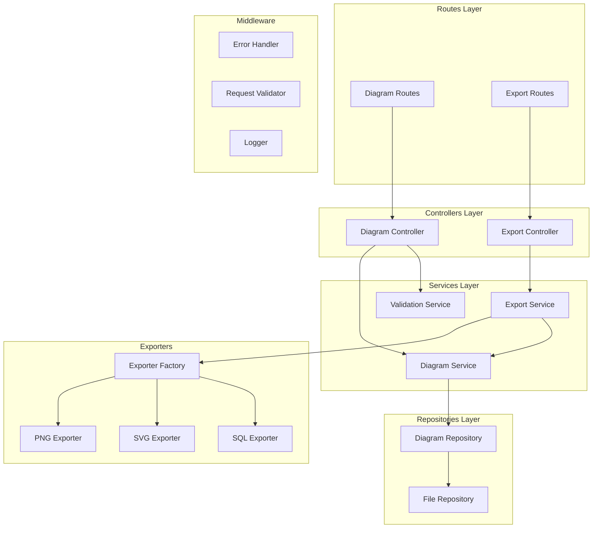

## 9. Request Flow Through Layers

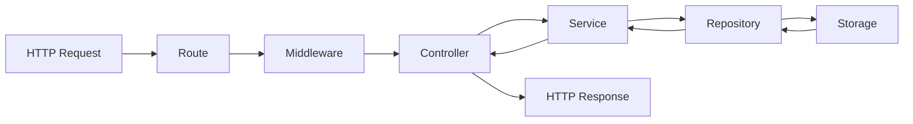

## 10. Error Handling Flow

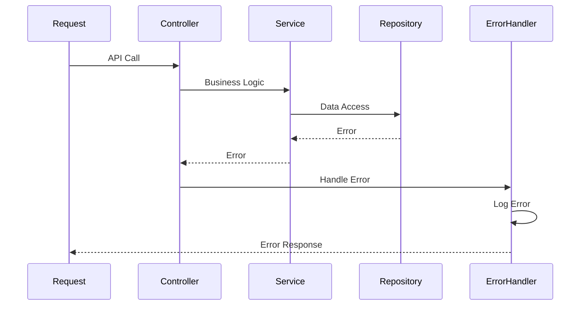

## 11. Middleware Chain

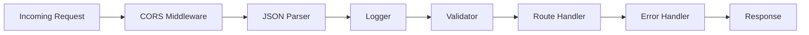

## 12. Repository Pattern

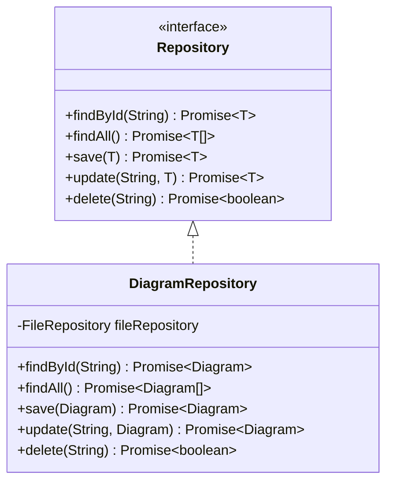

## 13. Factory Pattern - Exporters

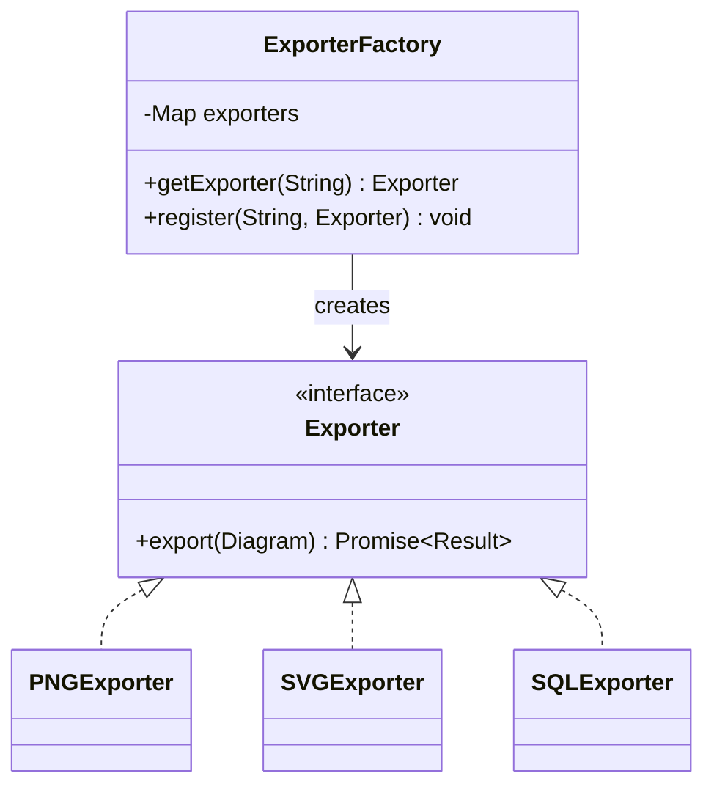

## 14. Revision History

| Version | Date | Author | Changes |
|---------|------|--------|---------|
| 1.0 | 2024 | - | Initial backend design document |
| 2.0 | 2024 | - | Refactored to focus on logical diagrams |
