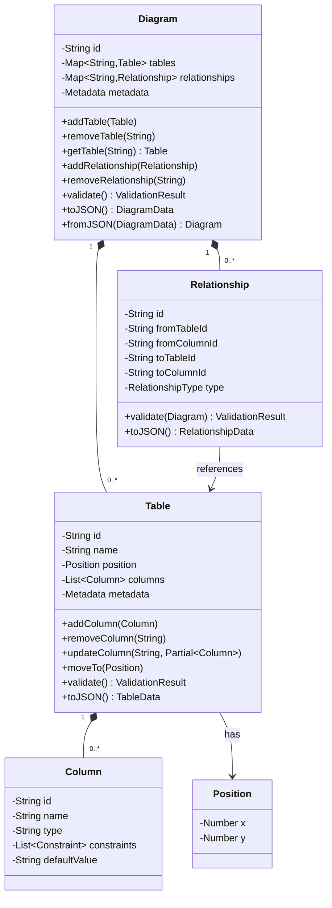
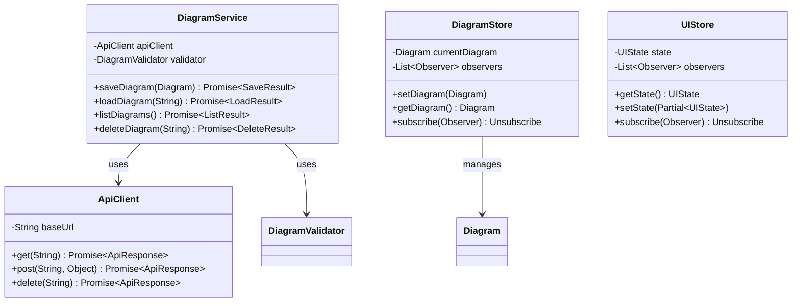
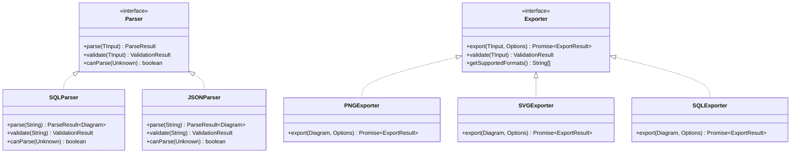
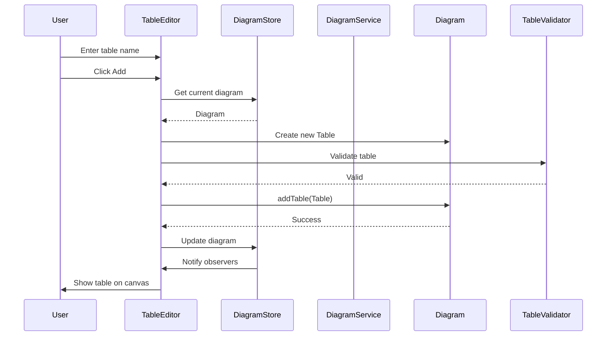
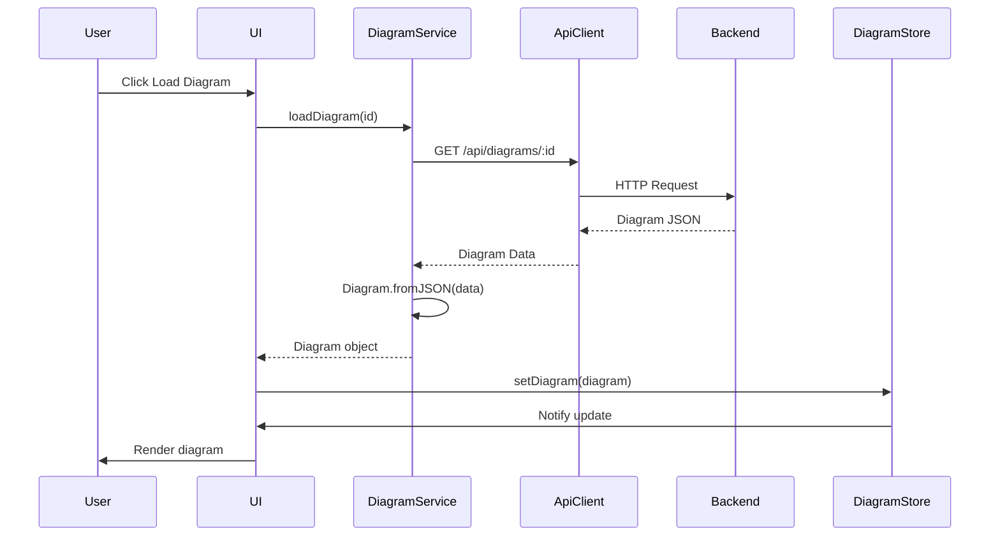
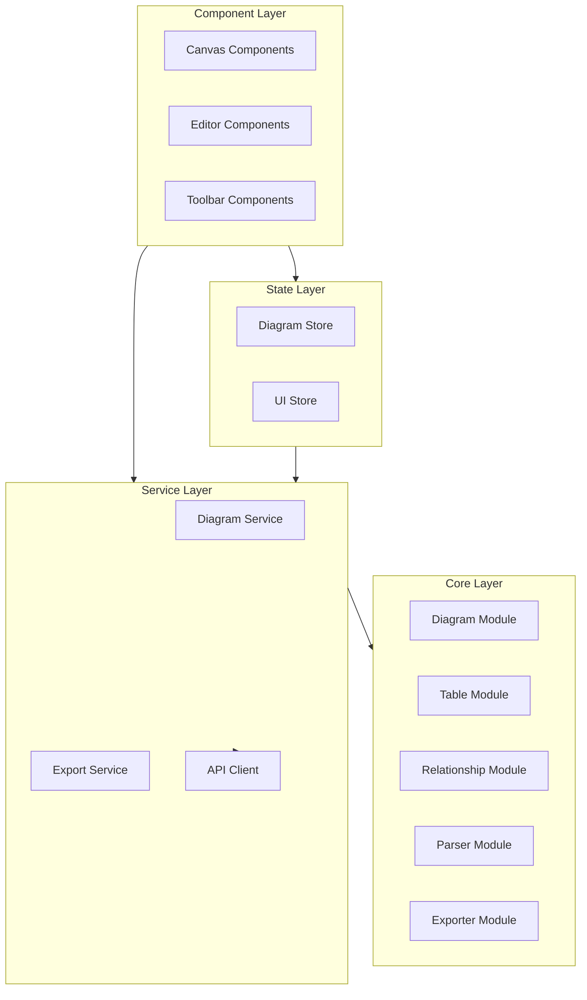
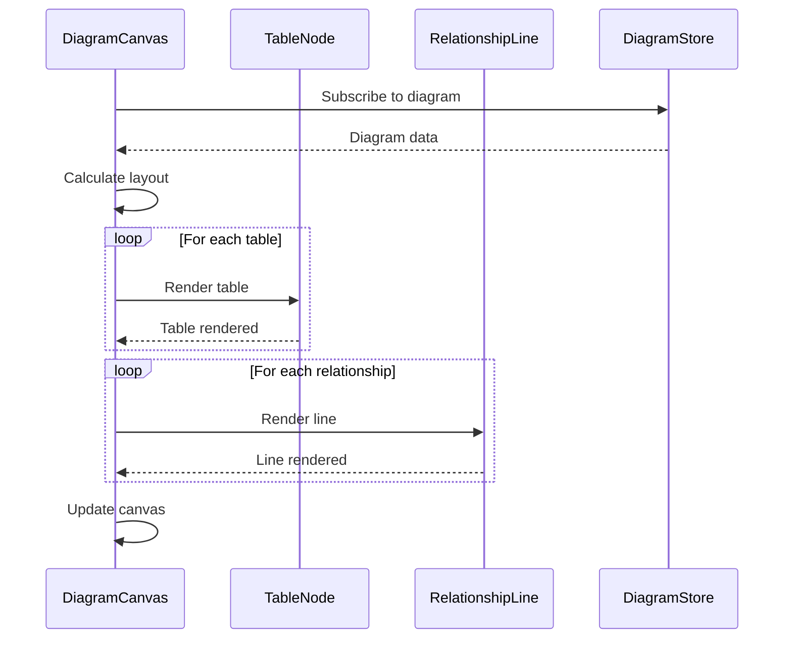
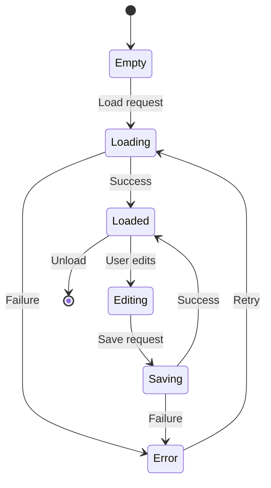
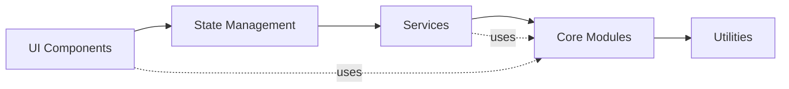

# MyDBDiagram.io - Frontend Design Document

## 1. Overview

This document describes the frontend architecture and design of MyDBDiagram.io at a logical level, focusing on class relationships, component interactions, and module structure through diagrams.

## 2. Frontend Architecture Overview

The frontend is organized into layers:
- **UI Layer**: React/Vue components for user interaction
- **State Layer**: Application state management
- **Service Layer**: API communication
- **Core Layer**: Business logic and domain models

## 3. Class Diagram - Core Domain Models

## 4. Class Diagram - Services and State

## 5. Class Diagram - Parsers and Exporters

## 6. Sequence Diagram - Creating a Table

## 7. Sequence Diagram - Loading Diagram from Server

## 8. Block Diagram - Frontend Module Structure

## 9. Component Interaction - Canvas Rendering

## 10. State Management Flow

## 11. Module Dependencies

## 12. Revision History

| Version | Date | Author | Changes |
|---------|------|--------|---------|
| 1.0 | 2024 | - | Initial frontend design document |
| 2.0 | 2024 | - | Refactored to focus on logical diagrams |
