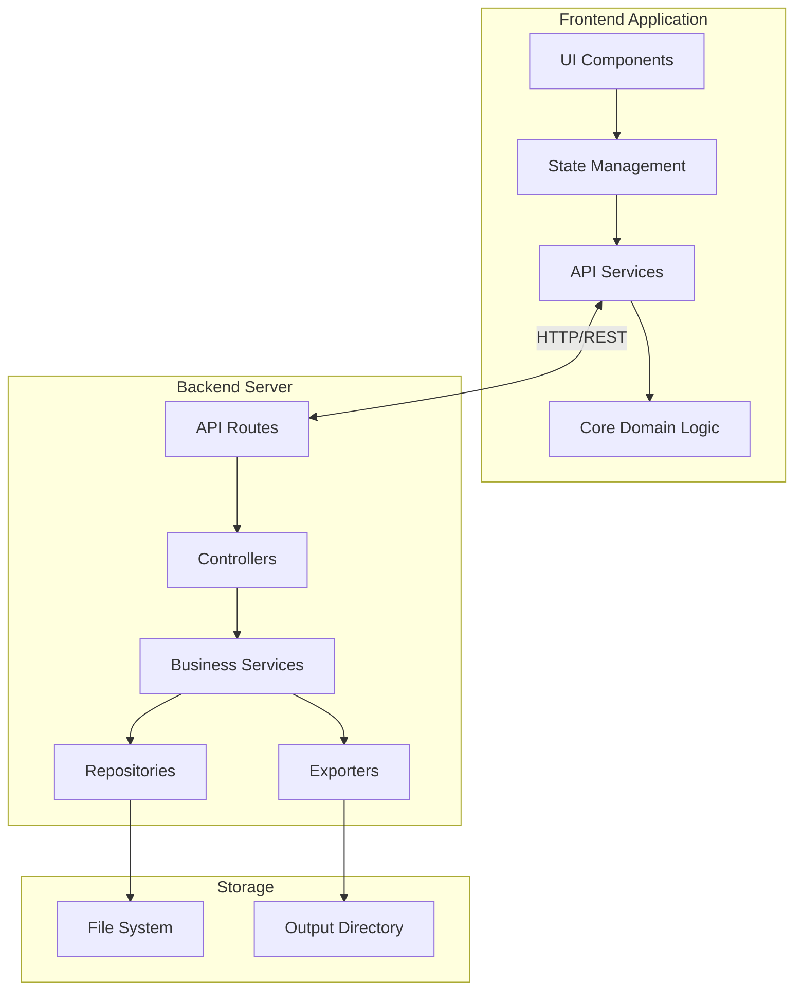
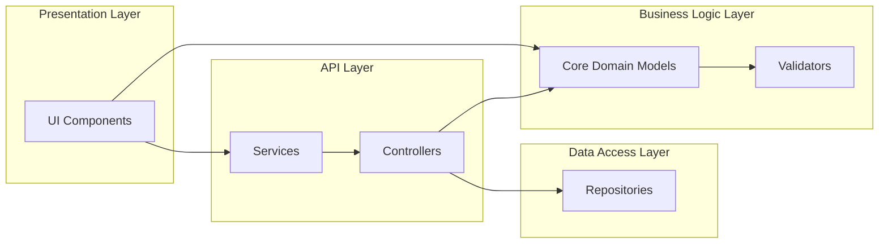
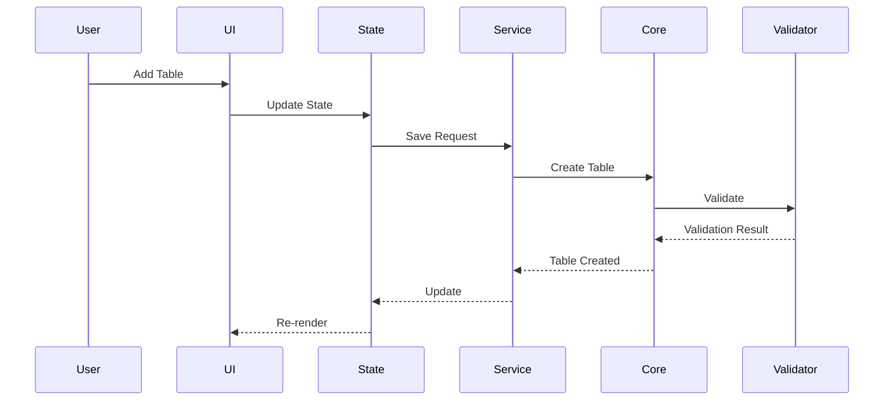
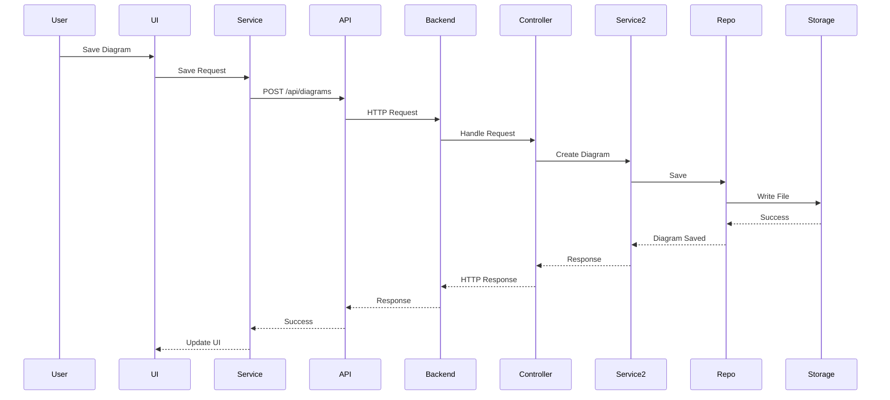
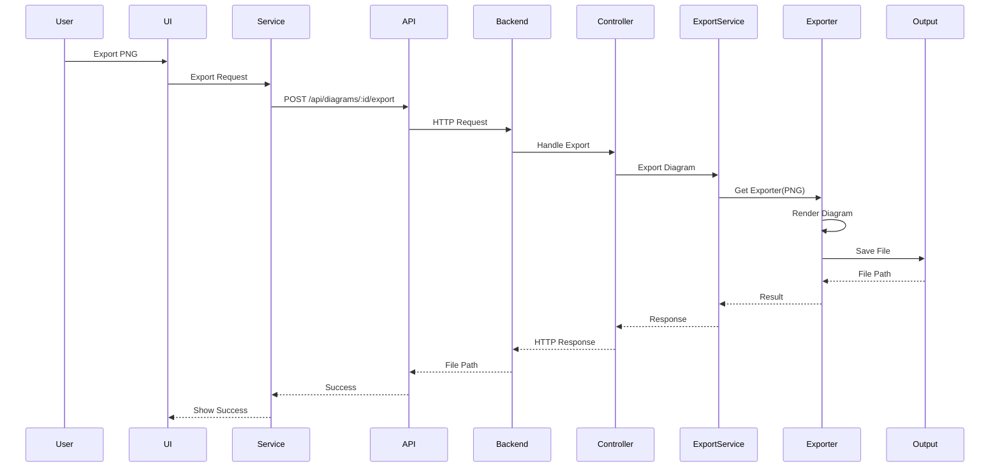
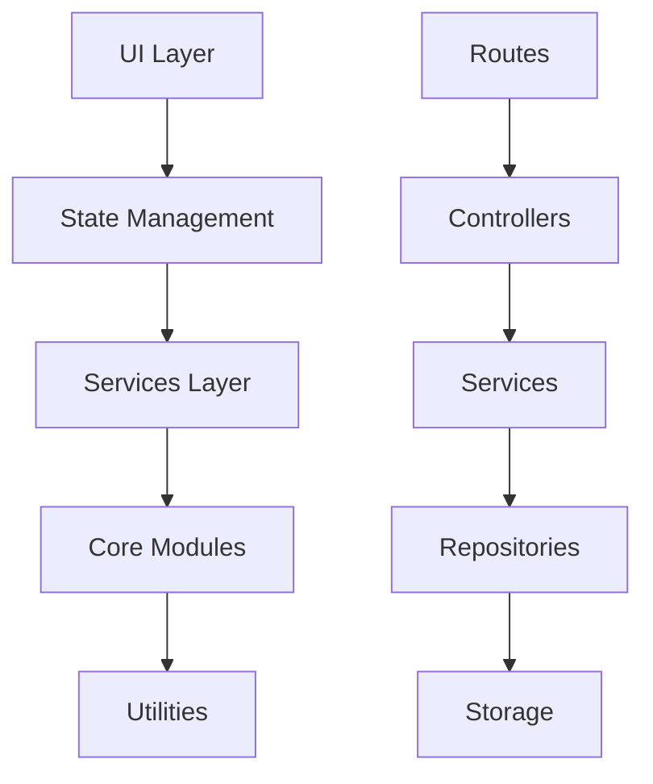
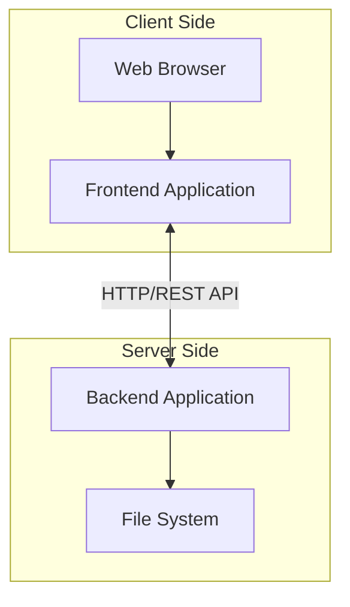

# MyDBDiagram.io - System Design Document

## 1. Overview

This document describes the overall system architecture of MyDBDiagram.io at a logical level, focusing on component interactions and system structure through diagrams.

## 2. Architecture Principles

- **Modularity**: Each module has a single responsibility, loosely coupled
- **Separation of Concerns**: Clear separation between Presentation, Business Logic, Data Access, and API layers
- **Dependency Injection**: Dependencies injected for testability
- **Testability**: Pure functions where possible, clear interfaces

## 3. Block Diagram - System Architecture

## 4. Block Diagram - Component Layers

## 5. Data Flow - Creating Diagram

## 6. Data Flow - Saving Diagram

## 7. Data Flow - Exporting Diagram

## 8. Module Dependencies

## 9. System Boundaries

## 10. Revision History

| Version | Date | Author | Changes |
|---------|------|--------|---------|
| 1.0 | 2024 | - | Initial system design document |
| 2.0 | 2024 | - | Refactored to focus on logical diagrams |
